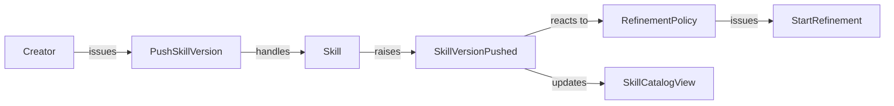

# Hindstorm

**Reverse event storming for .NET.** Event storming builds a model of a system by putting sticky notes on a wall during a workshop: orange events, blue commands, yellow aggregates, lilac policies. Hindstorm runs that backwards. You label your domain types with attributes, and Hindstorm reflects over the compiled assemblies to recover the same wall, derived from source instead of drawn by hand. Because it comes from the code, it can never quietly go stale.

The output is the model itself: JSON for tooling, or **Mermaid** and **Graphviz DOT** for a diagram. Rendering that into an interactive visual is a separate effort and out of scope here.



## Why attributes, not interfaces or base classes

- **Uniform.** Every concept carries one kind of label, so discovery is a single reflection query rather than a different rule per concept. A `static` policy class can't implement a marker interface; an attribute works on static classes, records, and sealed types alike.
- **Unopinionated.** Hindstorm ships no `AggregateRoot` or `IDomainEvent` base type. You keep your own building blocks; Hindstorm only reads the labels.
- **Edges are data.** Reflection can't see inside a method body, so it can't infer that an aggregate raises an event from the `new` statement. Instead the edge is *stated* as an attribute argument baked into assembly metadata, which the scanner reads back with no IL parsing.

## Packages

| Package | What it is | Depends on |
| --- | --- | --- |
| `Hindstorm.Annotations` | The attributes only. Zero dependencies, `netstandard2.0`. Reference this from your **domain** layer. | nothing |
| `Hindstorm` | The scanner and the JSON / Mermaid / DOT exporters. | Annotations |
| `Hindstorm.AspNetCore` | A dev endpoint that serves the model from a running app. | Hindstorm |

## Label your domain

```csharp
using Hindstorm;

[Aggregate]
public sealed class Skill
{
    [Handles(typeof(PushSkillVersion))]   // command -> aggregate
    [Raises(typeof(SkillVersionPushed))]  // aggregate -> event
    [Enforces(typeof(SkillSizePolicy))]   // aggregate -> policy
    public SkillVersionPushed PushVersion(PushSkillVersion command) { /* ... */ }
}

[Command] public sealed record PushSkillVersion(Guid SkillId, Guid CreatorId);
[DomainEvent] public sealed record SkillVersionPushed(Guid SkillId, Guid VersionId);

[Policy]
public sealed class RefinementPolicy
{
    [ReactsTo(typeof(SkillVersionPushed))]  // event -> policy
    [Issues(typeof(StartRefinement))]       // policy -> command
    public StartRefinement OnPushed(SkillVersionPushed pushed) { /* ... */ }
}
```

### Concept (node) attributes

`[Aggregate]` `[Command]` `[DomainEvent]` `[Policy]` `[ReadModel]` `[ValueObject]` `[ExternalSystem]` `[Actor]`

### Relation (edge) attributes

| Attribute | Edge it draws |
| --- | --- |
| `[Raises(typeof(E))]` | declaring → event |
| `[Handles(typeof(C))]` | command → declaring |
| `[ReactsTo(typeof(E))]` | event → declaring |
| `[Issues(typeof(C))]` | declaring → command |
| `[Enforces(typeof(P))]` | declaring → policy |
| `[Updates(typeof(R))]` | declaring → read model |

Relation attributes go on either the type or the specific method that owns the relationship; method placement records the member name on the edge.

## Recover and export the model

```csharp
using Hindstorm;

var model = DomainModelScanner.Scan(typeof(Skill).Assembly, options =>
{
    // Optional: harvest reaction edges from your own generic handler interface,
    // so event -> handler edges come for free without annotating each handler.
    options.HandlerInterface = typeof(IDomainEventHandler<>);
});

string mermaid = MermaidExporter.Export(model);
string dot     = DotExporter.Export(model);
string json    = JsonExporter.Export(model);
```

Untagged types referenced by a relation still appear, as **dashed inferred nodes**, so a forgotten label shows up on the diagram instead of vanishing. Turn that off with `options.InferUntaggedEndpoints = false`.

## Serve it from a running app

```csharp
using Hindstorm.AspNetCore;

if (app.Environment.IsDevelopment())
{
    app.MapHindstorm("/domain-model", o =>
    {
        o.Assemblies.Add(typeof(Skill).Assembly);
        o.ConfigureScanner = s => s.HandlerInterface = typeof(IDomainEventHandler<>);
    });
}
```

Then `GET /domain-model?format=mermaid` (or `dot`, or `json`).

## License

MIT
