# Hindstorm

**Reverse event storming for .NET.** Event storming builds a model of a system by putting sticky notes on a wall during a workshop: orange events, blue commands, yellow aggregates, lilac policies. Hindstorm runs that backwards. You label your domain types with attributes, and Hindstorm reflects over the compiled assemblies to recover the same wall, derived from source instead of drawn by hand. Because it comes from the code, it can never quietly go stale.

The output is the model itself: JSON for tooling, or **Mermaid** and **Graphviz DOT** for a diagram. Rendering that into an interactive visual is a separate effort and out of scope here.

A slice of the [order-to-cash sample](samples/Hindstorm.Sample), colored by concept the way a storming wall is:

```mermaid
flowchart LR
    customer["Customer"]:::Actor
    place["PlaceOrder"]:::Command
    order["Order"]:::Aggregate
    credit["WithinCreditLimit"]:::Invariant
    placed["OrderPlaced"]:::DomainEvent
    status["OrderStatusView"]:::ReadModel
    paypolicy["PaymentPolicy"]:::Policy
    auth["AuthorizePayment"]:::Command
    gateway["PaymentGateway"]:::ExternalSystem
    authorized["PaymentAuthorized"]:::DomainEvent

    customer -->|issues| place
    place -->|handles| order
    order -->|enforces| credit
    order -->|raises| placed
    placed -->|updates| status
    placed -->|reacts to| paypolicy
    paypolicy -->|issues| auth
    auth -->|handles| gateway
    gateway -->|raises| authorized

    classDef Actor fill:#BCAAA4,stroke:#4E342E,color:#000;
    classDef Command fill:#90CAF9,stroke:#1565C0,color:#000;
    classDef Aggregate fill:#FFE082,stroke:#F9A825,color:#000;
    classDef Invariant fill:#80CBC4,stroke:#00695C,color:#000;
    classDef DomainEvent fill:#FFB74D,stroke:#E65100,color:#000;
    classDef ReadModel fill:#A5D6A7,stroke:#2E7D32,color:#000;
    classDef Policy fill:#CE93D8,stroke:#6A1B9A,color:#000;
    classDef ExternalSystem fill:#F48FB1,stroke:#AD1457,color:#000;
```



The colors match the exporter output: brown actors, blue commands, yellow aggregates, teal invariants, orange events, lilac policies, green read models, pink external systems (grey value objects round out the set). The `%%{init: {"layout": "elk"}}%%` directive is omitted here so GitHub renders it; the exporter emits it by default.

## Why attributes, not interfaces or base classes

- **Uniform.** Every concept carries one kind of label, so discovery is a single reflection query rather than a different rule per concept. A `static` policy class can't implement a marker interface; an attribute works on static classes, records, and sealed types alike.
- **Unopinionated.** Hindstorm ships no `AggregateRoot` or `IDomainEvent` base type. You keep your own building blocks; Hindstorm only reads the labels.
- **Edges are data.** Reflection can't see inside a method body, so it can't infer that an aggregate raises an event from the `new` statement. Instead the edge is *stated* as an attribute argument baked into assembly metadata, which the scanner reads back with no IL parsing.

## Packages

| Package | What it is | Depends on |
| --- | --- | --- |
| `Hindstorm.Annotations` | The attributes only. Zero dependencies, `netstandard2.0`. Reference this from your **domain** layer. | nothing |
| `Hindstorm` | The scanner and the JSON / Mermaid / DOT exporters. | Annotations |
| `Hindstorm.AspNetCore` | A dev endpoint that serves the model from a running app. | Hindstorm |

## Label your domain

```csharp
using Hindstorm;

[Aggregate]
public sealed class Skill
{
    [Handles(typeof(PushSkillVersion))]   // command -> aggregate
    [Raises(typeof(SkillVersionPushed))]  // aggregate -> event
    [Enforces(typeof(SkillSizePolicy))]   // aggregate -> policy
    public SkillVersionPushed PushVersion(PushSkillVersion command) { /* ... */ }
}

[Command] public sealed record PushSkillVersion(Guid SkillId, Guid CreatorId);
[DomainEvent] public sealed record SkillVersionPushed(Guid SkillId, Guid VersionId);

[Policy]
public sealed class RefinementPolicy
{
    [ReactsTo(typeof(SkillVersionPushed))]  // event -> policy
    [Issues(typeof(StartRefinement))]       // policy -> command
    public StartRefinement OnPushed(SkillVersionPushed pushed) { /* ... */ }
}
```

### Concept (node) attributes

`[Aggregate]` `[Command]` `[DomainEvent]` `[Policy]` `[Invariant]` `[ReadModel]` `[ValueObject]` `[ExternalSystem]` `[Actor]`

`[Policy]` is a *reactive* rule ("whenever this event, issue that command"); `[Invariant]` is a command-time business rule an aggregate enforces before raising an event. They are different concepts and kept distinct, in line with Event Storming.

### Relation (edge) attributes

| Attribute | Edge it draws |
| --- | --- |
| `[Raises(typeof(E))]` | declaring → event |
| `[Handles(typeof(C))]` | command → declaring |
| `[ReactsTo(typeof(E))]` | event → declaring |
| `[Issues(typeof(C))]` | declaring → command |
| `[Enforces(typeof(I))]` | declaring → invariant |
| `[Updates(typeof(R))]` | declaring → read model |

Relation attributes go on either the type or the specific method that owns the relationship; method placement records the member name on the edge.

## Recover and export the model

```csharp
using Hindstorm;

var model = DomainModelScanner.Scan(typeof(Skill).Assembly, options =>
{
    // Optional: harvest reaction edges from your own generic handler interface,
    // so event -> handler edges come for free without annotating each handler.
    options.HandlerInterface = typeof(IDomainEventHandler<>);
});

string mermaid = MermaidExporter.Export(model);
string dot     = DotExporter.Export(model);
string json    = JsonExporter.Export(model);
```

Mermaid output uses the **ELK layout engine by default** (emitted as a `%%{init: {"layout": "elk"}}%%` directive), which lays cyclic, layered flows out far more cleanly than Mermaid's built-in renderer. Opt out with `MermaidExporter.Export(model, MermaidLayout.Dagre)`, or `?layout=dagre` on the endpoint.

Untagged types referenced by a relation still appear, as **dashed inferred nodes**, so a forgotten label shows up on the diagram instead of vanishing. Turn that off with `options.InferUntaggedEndpoints = false`.

## What it captures, and what it can't

Hindstorm recovers the *behavioral* model from code: the concepts and the flow between them. That is most of an Event Storming wall, but a wall built in a workshop carries narrative and spatial meaning that code does not, so a recovered model is a **topological graph, not a timeline**. The exporters anchor entry points (actors, initiating systems) on the left and lay the flow out rightward, but horizontal position reflects reachability, not chronology. The model deliberately does not invent:

- **Temporal order** — Event Storming arranges events left to right in the order they happen. Edges encode causality, not chronology, so the layout is not a timeline.
- **Pivotal events and bounded contexts** — which events are turning points, and where one bounded context ends and the next begins, are modeling judgments that live in people's heads, not in attributes.
- **Swimlanes** — parallel or alternative process streams are not distinguished.
- **Hotspots** — friction, disagreement, and open questions are the human heart of a storm and cannot come from code at all.

Treat the output as an always-true scaffold of the model, the starting point for a conversation, not a replacement for one. Tactical structure (entities, value objects) is also outside the behavioral view; a `[ValueObject]` is supported but sits apart from the flow.

## Serve it from a running app

```csharp
using Hindstorm.AspNetCore;

if (app.Environment.IsDevelopment())
{
    app.MapHindstorm("/domain-model", o =>
    {
        o.Assemblies.Add(typeof(Skill).Assembly);
        o.ConfigureScanner = s => s.HandlerInterface = typeof(IDomainEventHandler<>);
    });
}
```

Then `GET /domain-model?format=mermaid` (or `dot`, or `json`).

## Run the sample

`samples/Hindstorm.Sample` is a full order-to-cash e-commerce flow, fully annotated and split across
bounded-context namespaces (Ordering, Payments, Inventory, Shipping, ReadModels). It exercises the whole
vocabulary: four aggregates, a reactive policy chain (the saga), external systems (payment gateway,
carrier, email provider), invariants, read models, and a handler-interface projection. Run it to see the
~40-concept model recovered from code and printed as Mermaid (and written as `.mmd`, `.dot`, and `.json`):

```bash
dotnet run --project samples/Hindstorm.Sample
```

Paste the Mermaid into <https://mermaid.live> to see the wall.

## Contributing

See [CONTRIBUTING.md](CONTRIBUTING.md) for the build, the Conventional Commits format, and how releases are
cut and published. Conventions for AI coding agents live in [AGENTS.md](AGENTS.md).

## License

MIT
